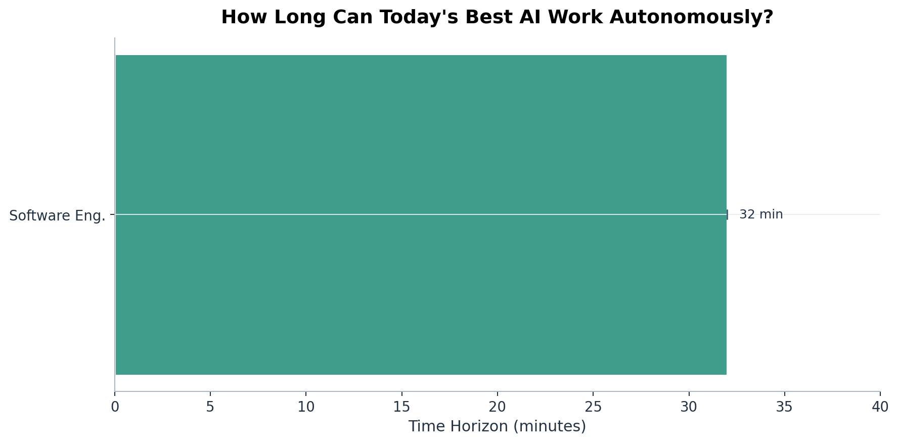
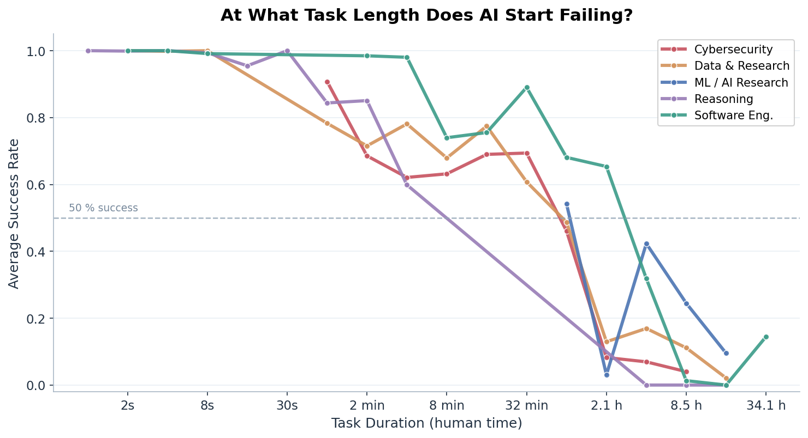
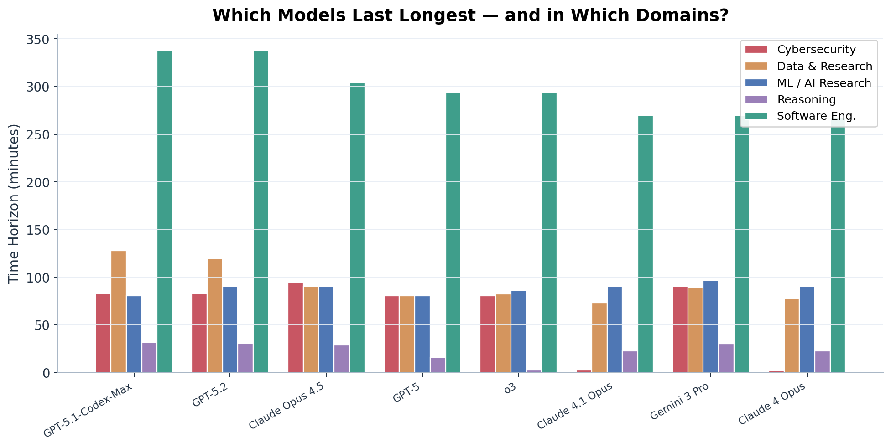
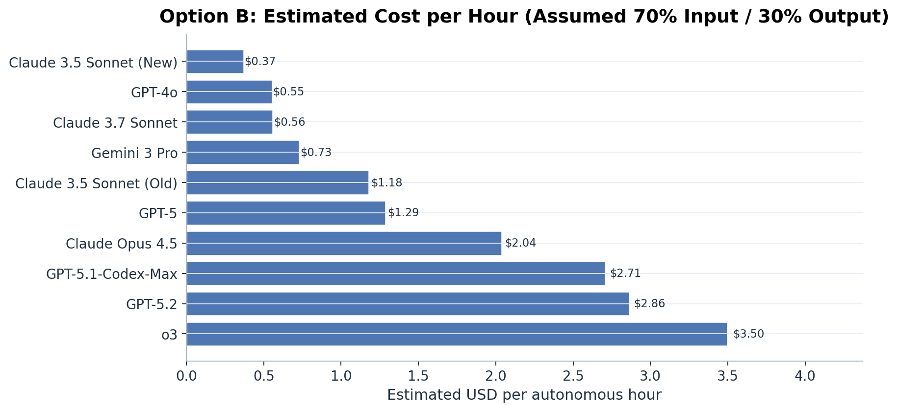

# How Long Can AI Actually Work on Its Own?

**A live, auto-updating tracker of AI autonomy across domains — built on [METR](https://metr.org/) benchmark data.**

---

One of the most consequential questions in AI right now isn't *how smart* models are — it's *how long* they can stay on task. Can an AI agent debug a codebase for an hour? Run a penetration test for a full afternoon? Train a model overnight without human intervention?

[METR](https://metr.org/) (Model Evaluation & Threat Research) measures exactly this: the **time horizon** of AI systems — the longest task duration at which a model still succeeds at least half the time. This project takes their public benchmark data, breaks it down by domain, and keeps the picture up to date automatically.

> **The charts below update weekly via GitHub Actions.** No manual curation — just data.

---

## The current picture

### How long can today's best AI work autonomously?

The headline number varies dramatically by domain. Some domains now support long autonomous runs, while others still break down quickly as task length grows.



*Each bar shows the estimated 50th-percentile time horizon — the task length at which the best available models still succeed half the time. Error bars indicate the confidence range across models.*

---

### At what task length does AI start failing?

Short tasks are easy. But as tasks stretch from seconds to minutes to hours, success rates fall off — and the drop-off point differs sharply between domains.



*Each line averages across all evaluated models for that domain. The dashed line marks 50% success — the conventional "time horizon" threshold.*

---

### Which models last longest — and where?

Not all models are created equal. Some excel at cybersecurity challenges but struggle with open-ended engineering. The chart below compares the top performers across domains.



*Top 8 models ranked by their best single-domain horizon. ML Engineering horizons are capped at the benchmark ceiling (512 min) for most models — real capability may be higher.*

---

### Option A: Token efficiency (assumption-free)

How many tokens does a model consume to sustain one successful hour of autonomous work?


*Lower is better. This chart uses observed `tokens_count` directly and does not assume an input/output split.*

---

### Option B: Estimated cost per autonomous hour (scenario)

How expensive is one successful autonomous hour if we assume an input-heavy agent workload (70% input / 30% output)?



*Scenario estimate based on model list prices and assumed token split. Interactive dashboard also includes 50/50 and 90/10 presets.*

---

## What this means

These numbers move fast. A year ago, the best AI agents could barely handle tasks longer than a few minutes. Today, several models sustain useful work for over an hour in at least one domain — and the frontier is still expanding.

This tracker exists to make that trajectory visible, domain by domain, as it happens.

**→ [Explore the interactive version](https://mathias3.github.io/METR-timehorizons-by-domain/)** for model-level drill-downs and adjustable forecasts.

---

## How it works

A Python pipeline ingests METR's public benchmark data weekly, fits time-horizon estimates per domain and model, and regenerates every chart and the interactive site. The whole process runs on GitHub Actions — zero cost, fully reproducible.

See [CONTRIBUTING.md](CONTRIBUTING.md) for how to add new benchmark sources or improve the analysis.

<details>
<summary><strong>Run it yourself</strong></summary>

```bash
python -m venv .venv && source .venv/bin/activate
pip install -e .[dev]
python -m pipeline.ingest
python -m pipeline.transform
python -m pipeline.fit
python -m pipeline.export
python -m pipeline.charts
```

Then open `site/index.html` in a browser.

</details>

---

## License

MIT — see [LICENSE](LICENSE).
